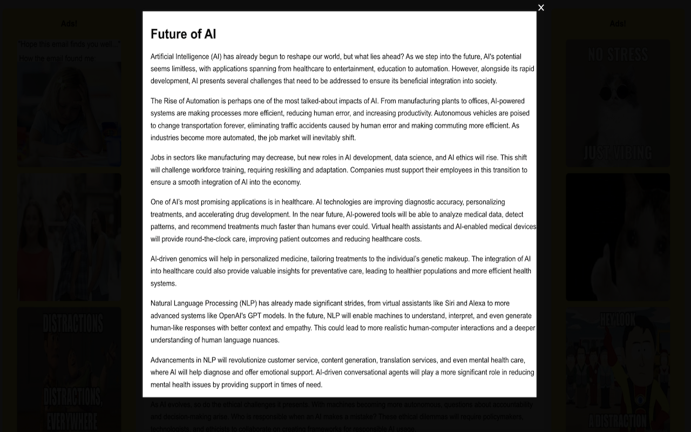

# FocusBox

**"See Only What You Want to See"** - The Productivity Chap Who's Got Your Back

Eliminate distractions and stay laser-focused on the task at hand with **FocusBox**. This productivity tool dims everything on your screen except the area you select, creating a distraction-free workspace for reading, writing, coding, or researching.

---

## 🚀 Features
- Dim everything on your screen except the selected area.
- Enhance productivity by reducing distractions.
- Perfect for reading, writing, coding, or researching.

---

## 🛠 How It Works

1. **Click on the FocusBox icon** in your browser toolbar.
2. **Drag to create a focus area** on the screen.
3. **Interact with the selected portion** of the page, while the rest is dimmed.
4. Use the **close button** to reset or **reload the page** to start again.

---

## 🌟 Why Use FocusBox?

FocusBox is your ultimate productivity companion:
- Stay laser-focused on tasks.
- Simplify online research.
- Improve workflow efficiency.

---

Start eliminating distractions and see only what you want to see with FocusBox!
